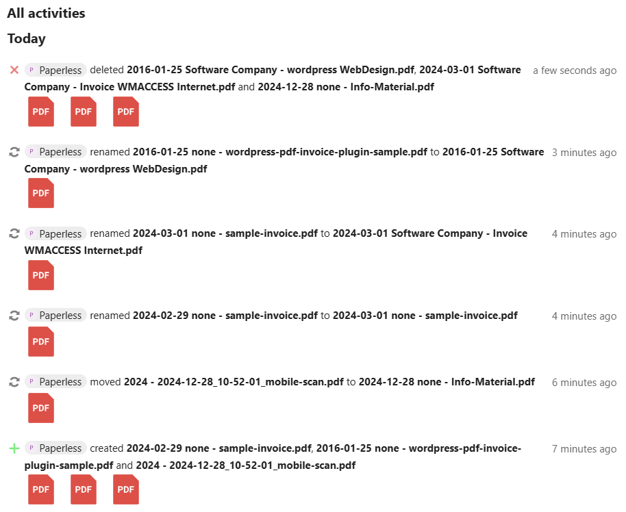

# Paperless-ngx to Nextcloud Real-Time Synchronization via WebDAV

This Docker image mounts a remote WebDAV source and synchronizes the data from `/mnt/source` to the mounted WebDAV drive in real-time. It is specifically designed for Nextcloud but may also work with other cloud systems that use WebDAV.

## Why this Project?
This project provides a seamless way to connect Paperless and Nextcloud, overcoming limitations found in other solutions. It fulfills the following key requirements:

- Easy and quick configuration.
- Synchronization with remote Nextcloud instances.
- Files created, deleted, or modified appear in Nextcloud’s Activity Feed.
- PDFs are searchable within Nextcloud.
- Real-time synchronization.

Synchronization is unidirectional (**Paperless ➔ Nextcloud**) to ensure Paperless’ data integrity.
<details>
<summary>Click here to see a graphical overview of the container's functionality:</summary>


</details>
<br>

---

## Preparation

### Requirements
- Administrative access to Nextcloud for adjusting user and brute-force settings.
- Dedicated Nextcloud account with read-write permissions for the synchronization container.

### Adjustments in Nextcloud
1. **Create a Dedicated Account**
   - Then share the synchronized files as **read-only** with users/groups to maintain data consistency.
2. **Brute-Force Settings**
   - Set log level **Info** - to view throttled events in the log.
   - Add the container’s IP to the whitelist in Nextcloud to prevent throttling during initial synchronization.

> **NOTE**: Are you struggling with this short description? [Read the full documentation.](documentation/README.md)

---

## Installation and Setup

### Steps
1. Clone this repository:
   ```bash
   git clone https://github.com/Flo-R1der/paperless-nextcloud-sync.git
   ```
2. Build the Docker image:
   ```bash
   docker build --file ./paperless-nextcloud-sync.Dockerfile --tag paperless-nextcloud-sync .
   ```
3. Add the container to your Paperless stack using Docker Compose:
   ```yaml
   version: "3"

   services:
     nc-sync:
       image: paperless-nextcloud-sync
       volumes:
         - "/mnt/data/paperless_data/Document_Library/documents/archive:/mnt/source:ro"
       environment:
         WEBDRIVE_URL: $NEXTCLOUD_URL
         WEBDRIVE_USER: $NEXTCLOUD_USER
         WEBDRIVE_PASSWORD: $NEXTCLOUD_PASSWORD
         TZ: Europe/Berlin
       privileged: true
       devices:
         - "/dev/fuse"
   ```
   - Fill in the `WEBDRIVE_URL`, `WEBDRIVE_USER`, and `WEBDRIVE_PASSWORD` values.
   - Use app passwords if two-factor authentication is enabled 
   - If you want to utilize [Docker secrets](https://docs.docker.com/compose/how-tos/use-secrets/) use `WEBDRIVE_PASSWORD_FILE` instead of `WEBDRIVE_PASSWORD`.
   - Optional: Define webdrive mounting options using `DIR_USER`, `DIR_GROUP`, `ACCESS_DIR`, and `ACCESS_FILE`.
   - Optional: set `LC_ALL` to any value from [this table](https://docs.oracle.com/cd/E23824_01/html/E26033/glset.html#glscx) if you experience filename issues with special characters.

4. Restart your Paperless instance to activate the container.
5. Verify the container is running:
   ```bash
   docker logs --follow <container-name>
   ```

> **NOTE**: Are you struggling with this short description? [Read the full documentation.](https://github.com/Flo-R1der/paperless-nextcloud-sync/blob/main/documentation/README.md)

### Container Start
- The WebDAV drive will be mounted.
- The initial synchronization is started as background-job.
- A file watcher monitors changes in real-time.
- If WebDAV and file watcher is running: the container’s health status shows "healthy".
- Logs provide detailed information about the synchronization process.


### Expected Results
- Initial synchronization uploads existing files, that are not existing in Nextcloud, newer in Paperless or moved/renamed.
- New files in Paperless are transferred to Nextcloud and appear in the Activity Feed:


<br>

## Open Topics
- [ ] Replace initial synchronization with a better solution. My tests with `rsync` caused file deletions during synchronization, which my script avoids but still produces error messages (see [log example](documentation/container-logs_example.txt), lines 20-24). **Please open issues only if you have a suitable solution!**
- [ ] Publish Docker image on GHCR and Docker Hub.

---

## Like My Work?
[](https://ko-fi.com/I3I4160K4Y)
